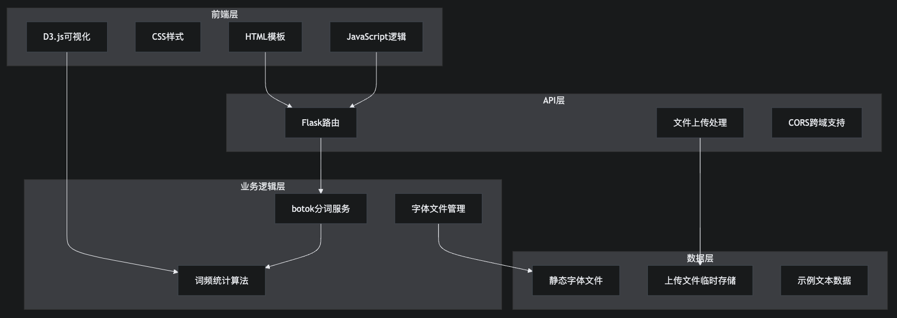

# 藏文词云生成器 (Tibetan Word Cloud Generator)

专为藏文设计的智能词云生成工具，支持多字体、多形状、多颜色自定义配置。


## 功能特性

### 🎯 核心功能
- **智能藏文分词**：基于 botok 分词库，准确识别藏文词汇
- **实时词云生成**：使用 D3.js 实现动态、交互式词云渲染
- **多格式导出**：支持高清 SVG 和 PNG 格式保存
- **响应式设计**：完美适配各种屏幕尺寸

### 🎨 个性化定制
- **多字体支持**：内置4种精美藏文字体，支持自定义字体上传
- **丰富形状选择**：10种词云形状（矩形、圆形、椭圆、三角形、菱形、五角形、六角形、星形、心形、云形）
- **灵活颜色配置**：自定义颜色选择器，支持多色彩搭配
- **可调参数**：词条数量、字体大小范围等精细控制

### 🚀 用户体验
- **三步式工作流**：文本输入 → 参数设置 → 结果生成
- **实时预览**：所见即所得的词云效果
- **动画效果**：平滑的入场动画和交互反馈
- **拖拽上传**：支持文本文件和字体文件上传

## 技术架构

### 后端技术栈
- **Flask**：轻量级 Web 框架
- **botok**：专业藏文分词处理库
- **Flask-CORS**：跨域请求支持
- **Werkzeug**：安全文件上传处理

### 前端技术栈
- **D3.js**：强大的数据可视化库
- **HTML5 + CSS3**：现代Web标准
- **JavaScript (ES6+)**：交互逻辑实现
- **Font Awesome**：图标库

### 核心算法
- **词云布局算法**：基于 D3 词云布局的阿基米德螺旋算法
- **字体嵌入技术**：Base64 编码确保保存文件的字体完整性
- **形状约束算法**：多种几何形状的词语分布算法

## 项目结构

```
TibetanCloudGen-main/
├── app.py                 # Flask 主应用
├── templates/
│   └── index.html        # 主页面模板
├── static/
│   ├── css/
│   │   ├── style.css     # 主样式文件
│   │   └── fonts.css     # 字体定义
│   ├── js/
│   │   ├── main.js       # 主要JavaScript逻辑
│   │   ├── d3.min.js     # D3.js库
│   │   └── d3.layout.cloud.js # 词云布局算法
│   ├── fonts/            # 字体文件目录
│   │   ├── 吞弥恰俊——尼赤乌坚体.ttf
│   │   ├── 方正藏意汉体简体.TTF
│   │   ├── Qomolangma-Title.ttf
│   │   └── Jomolhari-Regular.ttf
│   └── uploads/          # 上传文件临时目录
├── README.md             # 项目说明文档
└── images/              # 示例输出图片
```

## 快速开始

### 环境要求
- Python 3.7+
- 现代浏览器（Chrome、Firefox、Safari、Edge）

### 安装依赖

1. **克隆项目**
```bash
git clone <repository-url>
cd TibetanCloudGen-main
```

2. **安装Python依赖**
```bash
pip install flask flask-cors botok werkzeug
```

### 运行应用

```bash
python app.py
```

应用将在 `http://localhost:5000` 启动

### Docker 部署（可选）

```dockerfile
# Dockerfile
FROM python:3.9-slim

WORKDIR /app
COPY requirements.txt .
RUN pip install -r requirements.txt

COPY . .
EXPOSE 5000

CMD ["python", "app.py"]
```

## 使用指南

### 1. 文本输入
- **手动输入**：直接在文本框中输入藏文内容
- **示例文本**：使用内置的《入菩萨行论》文本
- **文件上传**：支持 .txt 格式的藏文文本文件

### 2. 参数设置
- **词条数量**：控制显示的词语数量（10-200）
- **字体大小**：设置最小和最大字体尺寸
- **颜色配置**：使用颜色选择器添加多种颜色
- **字体选择**：使用默认字体或上传自定义 TTF/OTF 字体
- **形状选择**：从10种预设形状中选择

### 3. 生成与保存
- **实时预览**：生成后可以查看交互式词云
- **重新生成**：保持设置重新生成词云
- **高清导出**：
  - SVG：矢量格式，支持无损缩放
  - PNG：3倍高清光栅图像

## API 接口

### 文本分词
```http
POST /tokenize
Content-Type: application/json

{
  "text": "藏文文本内容"
}
```

### 字体上传
```http
POST /upload/font
Content-Type: multipart/form-data

文件字段：font（支持 .ttf, .otf 格式）
```

### 文本文件上传
```http
POST /upload/text
Content-Type: multipart/form-data

文件字段：text（支持 .txt 格式）
```

## 浏览器兼容性

| 浏览器 | 版本要求 | 支持状态 |
|--------|----------|----------|
| Chrome | 60+ | ✅ 完全支持 |
| Firefox | 55+ | ✅ 完全支持 |
| Safari | 12+ | ✅ 完全支持 |
| Edge | 79+ | ✅ 完全支持 |

## 开发指南

### 本地开发

1. **启用调试模式**
```python
app.run(debug=True, host='0.0.0.0', port=5000)
```

2. **前端开发**
- 主要逻辑在 `static/js/main.js`
- 样式文件在 `static/css/style.css`
- 支持热重载，修改后刷新页面即可看到效果

3. **添加新字体**
- 将字体文件放入 `static/fonts/` 目录
- 在 `static/css/fonts.css` 中添加 `@font-face` 定义
- 更新 `static/js/main.js` 中的 `selectedFonts` 数组

### 自定义开发

#### 添加新的词云形状
```javascript
// 在 addShapeBackground 函数中添加新形状
case 'custom-shape':
    // 自定义形状的SVG路径或几何定义
    break;
```

#### 扩展颜色主题
```javascript
// 在颜色选择器中添加预设主题
const colorThemes = {
    'classic': ['#3b82f6', '#ef4444', '#10b981'],
    'warm': ['#f97316', '#eab308', '#dc2626'],
    // 添加更多主题
};
```

## 常见问题

### Q: 为什么上传的字体在保存时效果丢失？
- 确保字体文件格式正确（TTF/OTF），并且浏览器支持该字体。保存功能使用 Base64 嵌入技术确保字体完整性。

### Q: 词云生成失败怎么办？
- 检查输入文本是否为有效的藏文内容，确保文本长度适中（建议100-5000字符）。

### Q: 如何提高词云质量？
- 使用高质量的藏文文本
- 调整词条数量和字体大小范围
- 选择合适的颜色搭配
- 尝试不同的形状和字体组合

### Q: 支持哪些藏文编码？
- 支持标准的 Unicode 藏文编码（U+0F00-U+0FFF）。

### 开发规范
- Python 代码遵循 PEP 8 规范
- JavaScript 使用 ES6+ 语法
- CSS 使用语义化类名
- 提交信息使用中文描述


## 联系我们

- 项目维护者：[Pemawangchuk](https://github.com/bmwj)
- 项目仓库：[TibetanCloudGen](https://github.com/bmwj/TibetanCloudGen)
- 问题反馈：[Issues](https://github.com/bmwj/TibetanCloudGen/issues)
